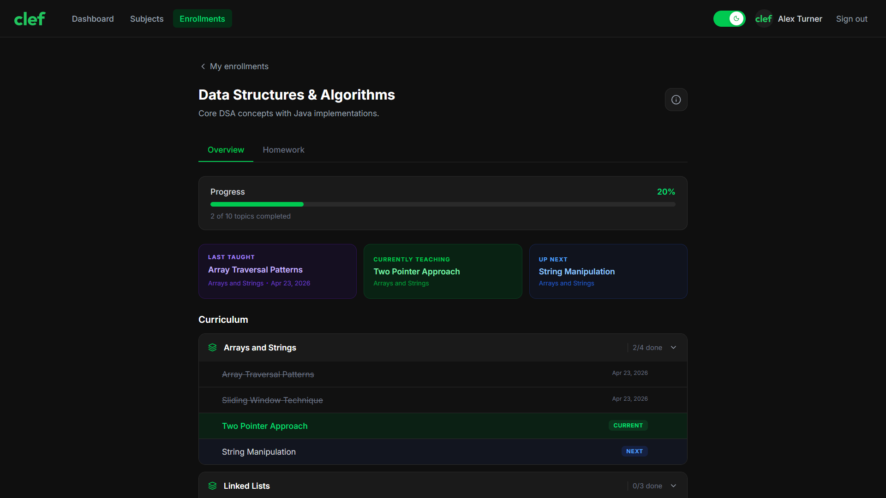
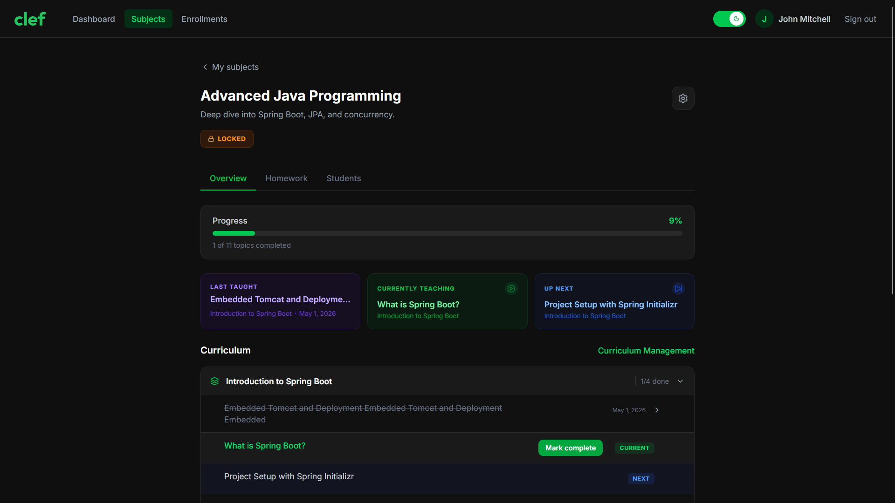
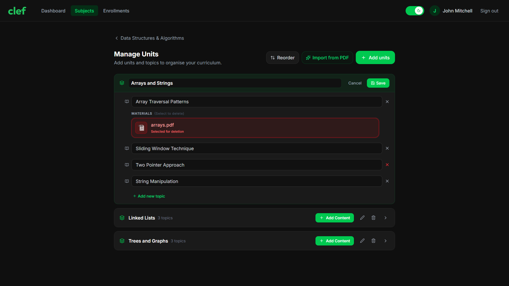
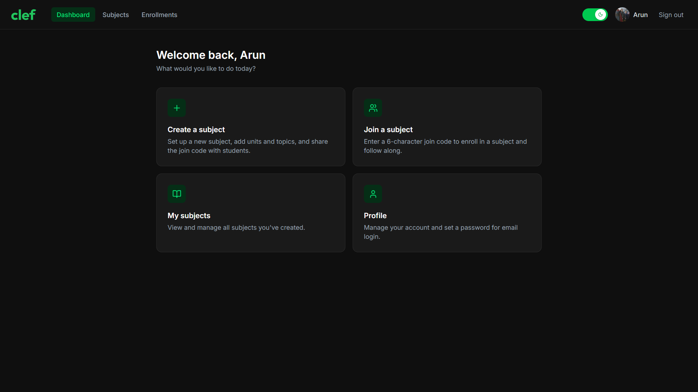
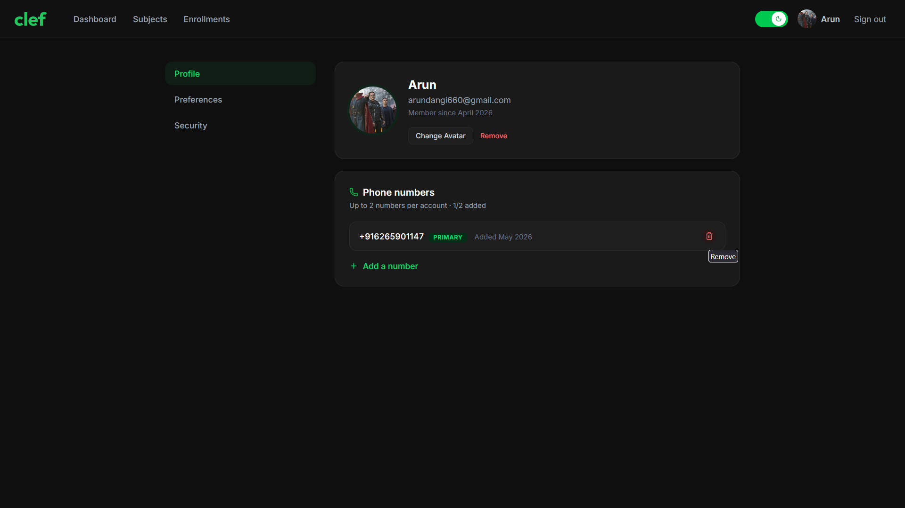

# Clef — Frontend

[](https://react.dev/)
[](https://vite.dev/)
[](https://tailwindcss.com/)

React frontend for [Clef](https://github.com/Enigmazer/clef-backend) — a teaching and course management platform that keeps every student in sync with their class.

**Live Demo:** [https://clefapp.vercel.app](https://clefapp.vercel.app)

> Live demo note: SMS OTP is simulated due to Twilio free tier limitations — enter the last 6 digits of your phone number to verify.

**Backend Repository:** [Enigmazer/clef-backend](https://github.com/Enigmazer/clef-backend)

---

## Tech Stack

| Area | Technology |
|---|---|
| Framework | React 19 |
| Build Tool | Vite 8 |
| Routing | React Router v7 |
| Server State | TanStack Query v5 |
| HTTP Client | Axios |
| Styling | Tailwind CSS v4 |
| Drag and Drop | dnd-kit |
| Icons | Lucide React |
| Deployment | Vercel |

---

## Features

### Teacher
- Create subjects; a unique 6-character join code is generated automatically
- Upload a syllabus PDF or use the built-in AI parser to extract units and topics from it, then review and bulk-create them
- Add, rename, reorder (drag and drop), and delete units and topics
- Set the current and next topic being taught; the pointer auto-advances when a topic is marked complete
- Upload study materials per topic (PDF, image, video, audio, document) and delete them
- Create homework entries with a title, description, due date, and linked topics
- View all enrolled students; remove individual students; lock or archive subjects

### Student
- Join a subject using the 6-character invite code
- See the current topic, the next topic, and the full curriculum structure at a glance
- Browse and open topic materials uploaded by the teacher
- View upcoming and past homework entries
- Unenroll from a subject at any time

### Profile and Account
- Sign in via Google, GitHub, or email and password
- Set a password for the first time or update it from the profile page
- Forgot password: re-authenticate via OAuth2 to set a new password without the old one
- Upload or remove a profile picture
- Add and verify a phone number via OTP (up to two numbers); promote a secondary number to primary
- Enable or disable SMS-based two-factor authentication
- Toggle phone number visibility to enrolled students
- Toggle whether the teacher or student section appears on the dashboard
- Log out from the current session or from all devices at once

---

## Pages and Routes

| Route | Page | Access |
|---|---|---|
| `/` | Landing | Public |
| `/login` | Login | Public |
| `/2fa-verify` | 2FA OTP entry | Public |
| `/reset-password` | Set new password after OAuth2 re-auth | Public |
| `/privacy` | Privacy Policy | Public |
| `/terms` | Terms of Service | Public |
| `/support` | Support | Public |
| `/dashboard` | Subject card grid | Protected |
| `/subjects` | Full subject list | Protected |
| `/subjects/new` | Create subject form | Protected |
| `/subjects/:id` | Subject detail — teacher view | Protected |
| `/subjects/:id/units` | Curriculum manager — units and topics editor | Protected |
| `/enrollments` | Enrolled subjects list — student view | Protected |
| `/enrollments/:id` | Subject detail — student view | Protected |
| `/profile` | Profile, security and preferences | Protected |

All protected routes are wrapped in a `ProtectedRoute` component. All non-critical pages use `React.lazy` and `Suspense` for code splitting.

---

## Project Structure

```
src/
  api/
    axios.js        # Axios instance with request/response interceptors
    tokenStore.js   # Module-level in-memory access token store
    auth.js         # Login, logout, refresh
    subjects.js     # Subject CRUD and enrollment
    units.js        # Unit management
    topics.js       # Topic management and materials
    users.js        # User profile and preferences
    phone.js        # Phone number verification

  context/
    AuthContext.jsx # User state, login handler, logout, token extraction

  hooks/
    useSubjects.js  # All subject-related TanStack Query hooks
    useUnits.js     # Unit mutation hooks
    useTopics.js    # Topic mutation hooks
    useProfile.js   # Profile and preference mutation hooks

  components/
    ProtectedRoute.jsx          # Redirects unauthenticated users
    BackendReadyGate.jsx        # Waits for backend to wake up on first load (cold start on Render)
    CurriculumAccordion.jsx     # Collapsible unit/topic tree
    MaterialPlayerModal.jsx     # In-app viewer for topic materials
    MiniPlayer.jsx              # Persistent audio playback bar
    UploadProgressIndicator.jsx # Upload status UI
    profile/                    # Profile section components
    subject/                    # Subject card and detail components
    units/                      # Unit and topic editor components

  pages/            # One file per route
  router/           # Route definitions and lazy page imports
  utils/            # Shared helpers
```

---

## Authentication Architecture

The access token is stored in JS module memory (`tokenStore.js`) — a module-level variable that is never written to `localStorage` or `sessionStorage`. This means:

- The token is invisible to malicious cross-origin scripts (no XSS surface via storage APIs)
- The token is wiped on page refresh, which is intentional — the app silently recovers the session using the `refreshToken` HttpOnly cookie on the next startup

The `AuthContext` handles the full lifecycle:

1. On mount, it checks the URL hash for `#at=<token>` — the pattern the backend uses after a successful OAuth2 redirect. The token is extracted, stored in memory, and the fragment is removed from the address bar immediately so it never sits in history or server logs.
2. It then calls `GET /users/me`. If the access token is missing (page refresh), the Axios interceptor catches the 401, calls `/auth/refresh` using the HttpOnly cookie, stores the new access token in memory, and retries the original request transparently.
3. If the refresh also fails, the user is redirected to `/login`.

The Axios response interceptor implements a request queue — if multiple requests 401 simultaneously during a refresh, they are held and retried once with the new token rather than each triggering a separate refresh call.

---

## Getting Started

### Prerequisites
- Node.js 18+
- The [Clef backend](https://github.com/Enigmazer/clef-backend) running locally on port `8081`

### Environment Variables

Create a `.env` file in the project root:

```env
VITE_API_URL=/api
```

This sets the Axios `baseURL`, so a call like `GET /users/me` becomes a request to `/api/users/me`. During local development, Vite's dev server intercepts all `/api/*` requests and forwards them to `http://localhost:8081` — this proxy rule is hardcoded in `vite.config.js` and is independent of the env var. In production on Vercel, the same `/api/*` path is rewritten to the backend on Render via `vercel.json`. The env var stays the same (`/api`) in both environments; only the underlying mechanism changes.

### Run Locally

```bash
git clone https://github.com/Enigmazer/clef-frontend.git

npm install

cp .env.example .env

npm run dev
```

The app will be available at `http://localhost:3000`.

---

## Build

```bash
npm run build
```

The output goes to `dist/`. The Vite config splits the bundle into named chunks — `react-vendor`, `query-vendor`, `icons-vendor`, and `vendor` — to maximise cache efficiency across deploys.

---

## Deployment

The app is deployed on Vercel. The `vercel.json` config handles two things:

**API proxy** — all `/api/*` requests are rewritten to the Render-hosted backend. This keeps the frontend and backend on the same origin from the browser's perspective, which allows the `SameSite=Strict` HttpOnly refresh token cookie to be sent automatically on every request without any CORS preflight overhead.

**SPA fallback** — all other paths return `index.html`, which is required for React Router to handle navigation on hard refresh or direct URL access.

Security headers are applied globally:

| Header | Value |
|---|---|
| `X-Content-Type-Options` | `nosniff` |
| `X-Frame-Options` | `DENY` |
| `X-XSS-Protection` | `1; mode=block` |

---

## Screenshots

1. **Subject Detail — Student View**


2. **Subject Detail — Teacher View**


3. **Curriculum Manager**


4. **Dashboard**


5. **Profile / Security**


---

## Author

**Arun Dangi** [LinkedIn Profile](https://www.linkedin.com/in/arundangi)  
Email: [arundangi660@gmail.com](mailto:arundangi660@gmail.com)

---

## License
© 2026 Arun Dangi. All rights reserved.